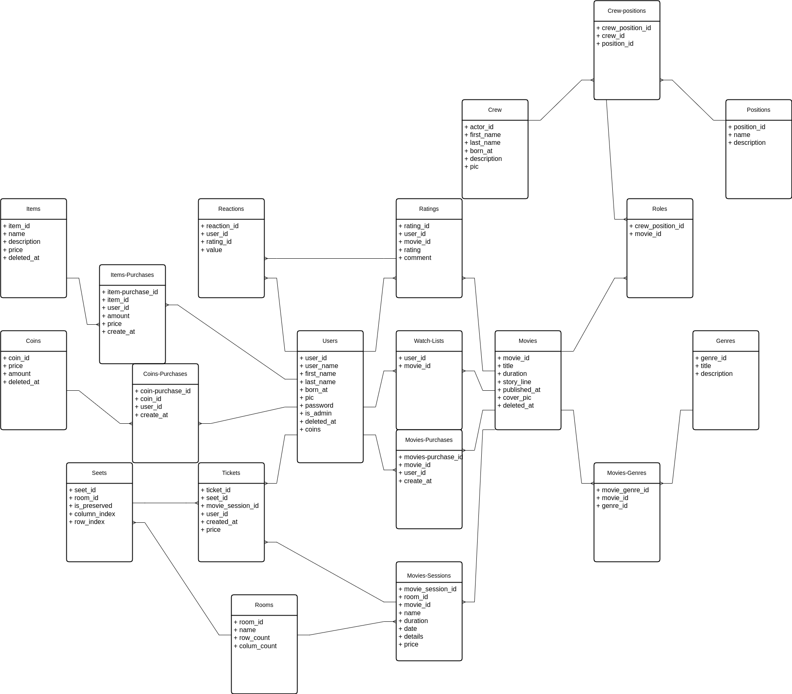

# cinema managment system

managing a cinema is a hard task to do, and If it is not managed write that could lead to a disaster and a huge lost to you
and that why we have created a managment system for you, that will do the hard stuff for you, the repedative stuff and make you focus on the important stuff on making money

our cinema managment system is design to be used by :

1. your cinema staff member
2. your customer

were each one of them can

## Features

here is the list of the feature that the api provide

### For Stuff

- add ,remove movies
- add ,remove crew to the movie
- add ,remove genra to the movie
- manage the coins transaction
- manage the item and movies purchases
- manage the ticket and movies sessions

### For Customer

- surfe the movies
- add movie to his watch list
- check the movies crew and genra
- check the movies rating and rating movies
- buy ticket for the movies
- buy items from the movie store like murch and pop corn

## ERD

and here is an erd for the app

## contact

[github](https://github.com/khaled-al-hamwie)
[linked in](https://www.linkedin.com/in/khaled-al-hamwie-869237200/)
[email](khaledAlHamwieContactAcccount@gmail.com)
